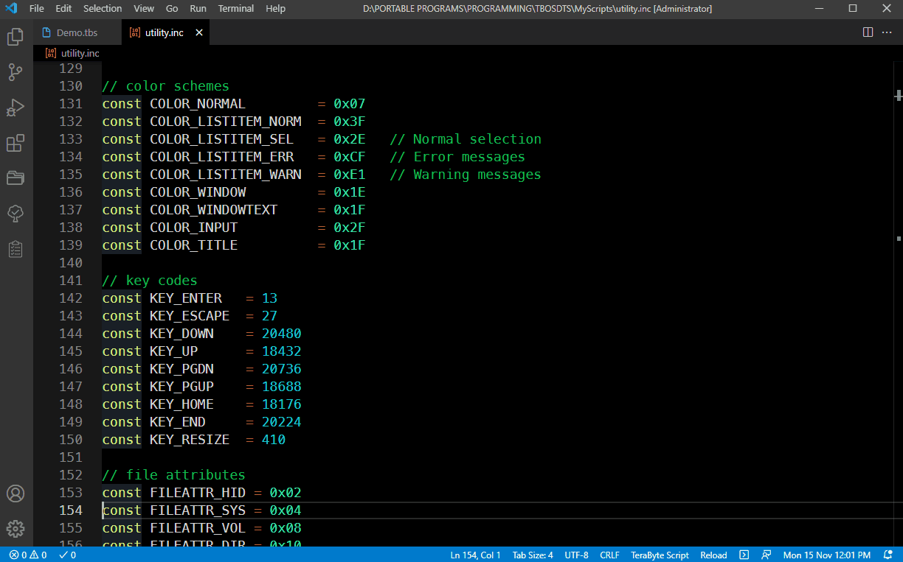
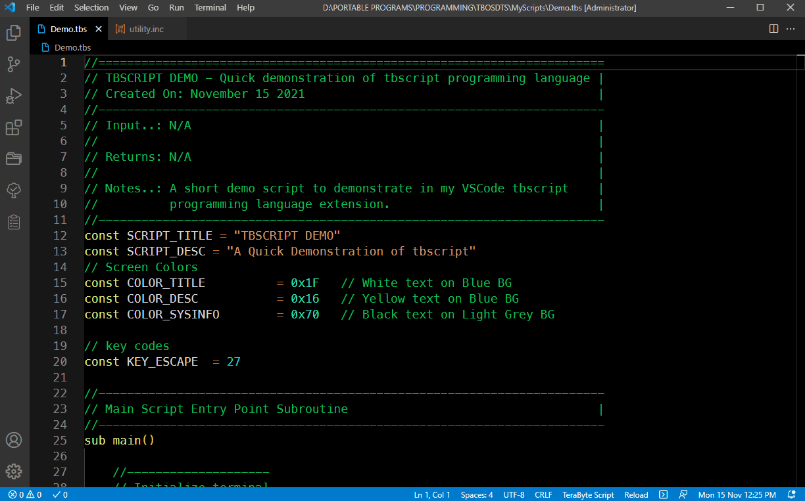
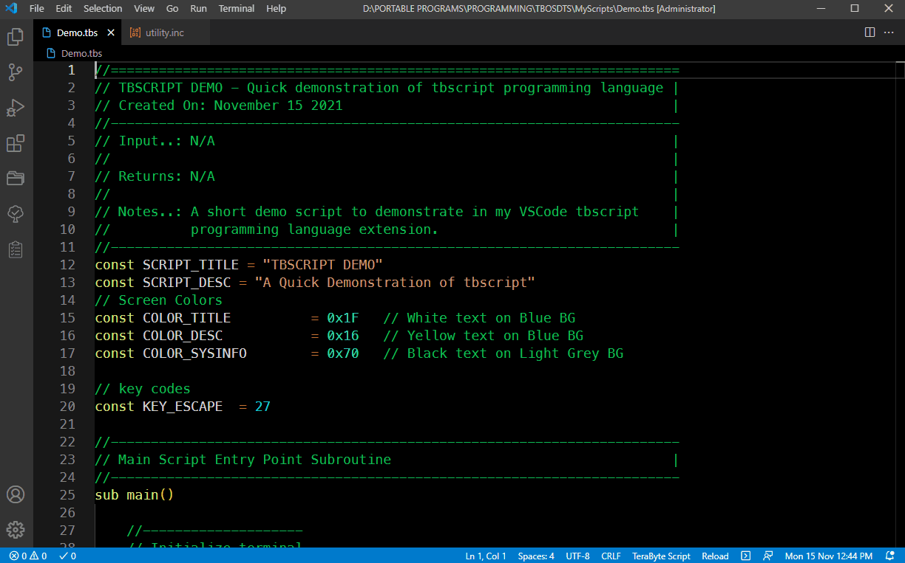
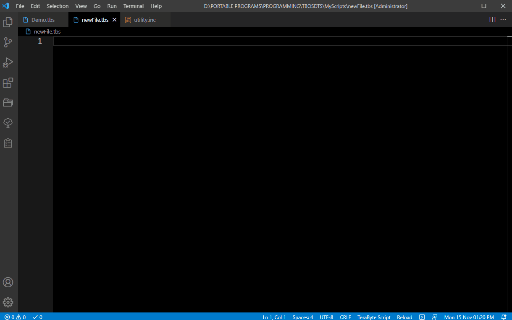

# tbscript README

Language support for TeraByte's tbscript programming language.

## Features
- Syntax Highlighting
- Run your scripts from within VSCode
- Snippet Support

## Screenshots

Syntax Highlighting.

Run in Internal TBCMD.

Run in External TBCMD.

Snippet Support.

## Requirements
[TeraByte OS Deployment Tool Suite](https://www.terabyteunlimited.com/tbosdt/)

## Extension Settings
The only setting required is the path to the `TBCMD` executable.
In Windows, either ***tbosdtw.exe*** or ***tbosdtw64.exe***.
The default setting is ***tbosdtw64.exe*** without the path.
If this executable is located in the PATH Environment Variable then it will work as is.
Otherwise you will need to set the full path to the executable.

## Extension Commands
- **F6**: `TeraByte Script: Run Script in Internal TBCMD`
- **Shift+F6**: `TeraByte Script: Run Script in External TBCMD`

Note: The command `Run Script in External TBCMD` requires that the file extension `TBS` be associated with
the `TBCMD` executable in order to  execute successfully (In Windows, either ***tbosdtw.exe*** or ***tbosdtw64.exe***)

## Snippet Notes
This language extension includes 3 snippets.

* New Main Subroutine (Trigger - `snipNewMainSub`)           Creates a New Main Subroutine.
* New Support Subroutine (Trigger - `snipNewSupportSub`)     Creates a New Subroutine.
* Demo Script (Trigger - `snipDemoScript`)                   The Demo Script used in the Screenshots.

Read the comments in the [tbscript.json](./src/snippets/tbscript.json) snippet file for more information on creating your own snippets.
Feel free to delete, or modify these as you desire...

## To Do
I would like to add `intellisense` and `hover` support eventually.

## Known Issues
[TeraByte OS Deployment Tool Suite](https://www.terabyteunlimited.com/tbosdt/) only supports Windows, Linux, and DOS.
There is no MAC version of the tool availiable.

## Release Notes

See the [Release Notes](RELEASE.md) for details.

